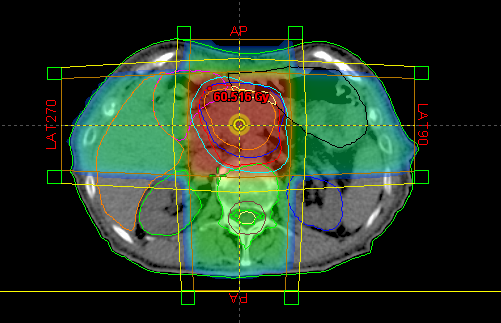

# Contents:

- [Project plan](project_plan.md)
- [Geant4 help](Geant4-help.md)

# Overview

One effective way of treating cancer tumors in hospitals is radiation treatments. There are many methods of radiation treatment including using linear accelerator (LINAC) machines. These machines deliver radiation through X-Rays, shooting them into the body to annihilate the tumor. Collateral damage to other organs is minimized as the machine rotates around the patient, so that all the radiation goes through the tumor but only portions go through the body's outer layers.

This project aims to computationally model a radiation treatment using the LINAC machine. I will be conducting research to learn exactly how this machine works and delivers the radiation. Then, I will model how much damage will be affecting each layer of the body as the dosage is delivered, as well as how much dose was delivered to the tumor.

I created this prezi presentation to illustrate how a LINAC machine works:
[How a LINAC distributes and measures dose](https://prezi.com/view/LCqqiqkJdII7mVcUly4L/)

# Development Environment

This project will be developed primarily in [Geant4](https://geant4.web.cern.ch/), a high-level C++ Toolkit for the simulation of the passage of particles through matter. In this repository I will have several tutorials and guide on how to use Geant4, because it is very complicated. 

# Research Articles

- [Detailed article on RF LINACs](https://cds.cern.ch/record/1982425/files/295-329%20Vretenar.pdf)

# Useful Websites

- [Simple explanation of LINAC machines](https://www.radiologyinfo.org/en/info/linac)
- [Types of LINACs used for radiation oncology](https://www.oncologysystems.com/resources/linear-accelerator-guides)

# Future Work

# GitHub themes
- https://pages.github.com/themes/ 
