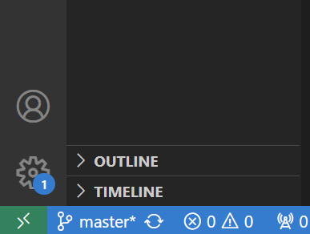
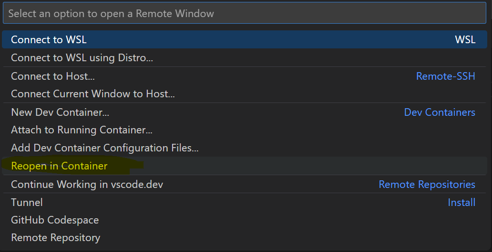

# Dockerizing Geant4
- [home](README.md)
- Author: John Francis
- Date: 10/11/2023
- Development environment: Windows 11, docker 24.0.5, VSCode

Contents:
- [Intro](#intro)
- [Docker beginners tutorial](#docker-beginners-tutorial)
- [Basic Geant4 environment](#basic-geant4-environment)
- [Open a directory inside a container in VSCode](#How-to-open-a-directory-inside-of-a-container-VSCODE)
- [Datasets](#datasets)
- [Visualization](#visualization)
- [Data Analysis](#data-analysis)
- [Docker compose](#docker-compose)

# Intro

Docker is an incredibly useful tool for cross-platform application development. It can be used to develop using Geant4 without installing Geant4 locally on your machine. It can also be used to standardize your Geant4 application so that anyone with docker can run it on their machine. These two benefits can greatly improve Geant4 application development and distribution.

In this article, I will be going over how I dockerize my personal Geant4 applications. I am coming from a Windows 11 environment, but the principles should apply to any operating system. 

# Docker beginners tutorial

If you're brand new to docker, here's a crash course to get you started.

Docker is an environment that runs lightweight virtual machines, basically mini operating systems with files and dependencies. For example, if you wanted to run a python script, you would first need to install python. Then if you want to install any libraries, let's say pandas or matplotlib, you would have to install those as well. Someone else using your program would need to install the same things if they wanted it to work on their computer. In docker, we can install and configure python, pandas, and matplotlib, as well as your program, that way the person simply opens the docker environment, and your program works. 

For docker to work, we need three things: the docker daemon, a docker image, and a docker container. 

**Daemon**
The docker daemon is the runtime for docker. In windows and mac, it would be in the form of tha application "docker desktop." It needs to be running in order to build a docker image, run a docker container, or do anything else with docker.

**Image**
A docker image is the instructions for the environment. To create a docker image, we create a file called, "dockerfile." then when we run the "build" command, our dockerfile gets "compiled" into a docker image. When we are ready to run our environment, we need to give it our docker image so it knows what to do. For our python example, the docker image would say to download python, download pandas, download matplotlib, and put them all in the correct directories so that the program can find them when it's time to run. 

Docker images can be built off of eachother. For example, to download python in our docker image we might need some instructions in our dockerfile similar to the following:
```
# Dockerfile

# Use a base image (e.g., Debian) as a starting point
FROM debian:bullseye

# Update the package repository and install necessary tools
RUN apt-get update -y && apt-get install -y \
    wget \
    build-essential

# Download and install Python
RUN wget https://www.python.org/ftp/python/3.8.12/Python-3.8.12.tgz
RUN tar xvf Python-3.8.12.tgz
RUN cd Python-3.8.12 && ./configure && make && make install
```
In the first line we see the `FROM` keyword. This is basically building off of a previously created image. In this case it is a linux environment. Then, we proceed to download python by installing it from python.org. 

An alternative way would be to build off of python's official docker image. We can replace the entire previous dockerfile by this one:
```
FROM python:latest
```
This is really nice, because instead of having to build our entire environment from scratch, we can build off of work that's already been done. 

**Container**
Once we have a docker image built, we want to run it. To do so, we create a docker container. A container is a tiny virtual machine that runs a docker image. So we run a container, specifying our image, and we have our isolated environment running. 

In our python example, it creates a miniature linux operating system and installs python. Now if we want to run our python program, we make sure we are inside the docker container and we are good to go.

**Useful docker commands**
To build a docker image, we navigate to the directory of our Dockerfile, and run:
```
docker build .
```
Another common option is to give our docker image a name. This has many benefits, one of which is we can share our dockerfile and publish it to docker hub. That way anyone else with docker can use our docker image and run our application. To name or "tag" our image, we run:
```
docker build -t my-image:0.1.0 .
```
To run a docker container, we run this command: 
```
docker run my-image:0.1.0
```
This opens a container, creating an environment that we configured in `my-image`.

# Basic Geant4 environment

First, we can run Geant4 in a container without needing to install it locally. If you have seen my [Geant4 installation tutorial](g4-install-instructions-windows.md), you can already see the benefit of this. We're talking about minutes of setup instead of hours, not to mention saved memory on your computer. 

To use Geant4 in docker, VSCode makes it super simple. Let's say we have a simple Geant4 cmake project created. For this tutorial, I will be using my own [G4-Hello-World](https://github.com/john9francis/G4-Hello-World). To dockerize, we can use the official Geant4 docker image. 

Let's create a dockerfile in our geant4 project, and add the following line in it:

```
# dockerfile
FROM geant4/geant4
```

Now, if we open our directory inside this container, we will have Geant4 all linked up and ready to go. 

## How to open a directory inside of a container VSCode
To open a directory inside a docker container in VSCode, we can do the following:
1. Download the [Dev Containers](https://marketplace.visualstudio.com/items?itemName=ms-vscode-remote.remote-containers) extension for VSCode
2. Make sure docker desktop is running in the background
3. Open our Geant4 project directory in VSCode
4. Click on the green arrows button in the bottom left hand corner of the VSCode window:



5. In the top menu that pops up, click, "Reopen in container"



6. This should automatically create a docker image using the dockerfile we have created, and then start a docker container and open the current directory in this container.

Congratulations, you now have the Geant4 environment activated in your directory. 

To test for this particular project, we can open a terminal in our VSCode window. It should have bash automatically activated. We can then compile the project by running the following commands:
```bash
mkdir docker_build
cd docker_build
cmake ..
make
```

Now we have our geant4 project compiled. To do a test run, we run this command:
```bash
./Hello_World test.mac
```
Now, we should see "Hello World" displayed on the console.
```bash
Hello World
```
This means that the project is all successfully compiled, configured, and built with Geant4. However, we aren't done yet. Notice that if you try just running `./Hello_World` without the second argument, `test.mac`, you get an error. This is because the Geant4 gui can't quite work with docker right now. For more info, see [Visualization](#visualization). Furthermore, if we have a Geant4 project with any sort of physics modeling, we likely use some datasets. Well, the Geant4 docker image doesn't include these datasets, which we will see in the next section.

# Datasets
Let's try running an actual Geant4 physics simulation in docker now. We will use my own project, [Test Calorimeter](https://github.com/john9francis/G4-Test-Calorimeter).

Let's get our simple dockerfile attached, 
```
FROM geant4/geant4
```
And open this project in our docker container by following the steps [above](#How-to-open-a-directory-inside-of-a-container-VSCODE).

We build our project with cmake:
```
mkdir docker_build
cd docker_build
cmake ..
make
```
Now, let's run a simulation of Test Calorimeter by running this command in our bash:
```
./Test_Calorimeter init.mac
```
We should see the following error:

```
-------- EEEE ------- G4Exception-START -------- EEEE -------
*** G4Exception : PART70000
      issued by : G4NuclideTable
G4ENSDFSTATEDATA environment variable must be set
*** Fatal Exception *** core dump ***
 **** Track information is not available at this moment
 **** Step information is not available at this moment

-------- EEEE -------- G4Exception-END --------- EEEE -------


*** G4Exception: Aborting execution ***
Aborted
```
This error is unfortunately because the official Geant4 docker image does not contain the Geant4 [datasets](https://geant4.web.cern.ch/download/). So if we want this project to work, we are going to need to get the Geant4 datasets in our docker image.*

\* Here we are going to add the datasets to our docker image. For now, we are going to put them in the same image, and it will just take a bit longer to build. However, by the [end](#docker-compose) of this tutorial, we will split them back up into separate images so we get the benefit of good performance and lightweight containers. 

So to get the Geant4 installation along with the datasets into our image, we are going to utilize a tool that someone created for us. I have found this "geant4-runtime" docker image to be a useful one to use:
```
FROM koichimurakamik6/geant4-runtime
```
Personally, mine didn't quite work because there was one variable messed up. But that was fixed by adding this line:
```
FROM koichimurakamik6/geant4-runtime

# setting this variable that geant4 can't find
ENV LD_LIBRARY_PATH=/opt/geant4/lib:$LD_LIBRARY_PATH
```
Now let's try rebuilding our project. This can easily be done by deleting the `docker_build` directory, reopening our directory in the docker container, and repeating the steps we did before:
```
mkdir docker_build
cd docker_build
cmake ..
make
```
Then, when we run `./Test_Calorimeter init.mac`, we see evidence that Geant4 is set up correctly. We see outputs of the physics list initializing and everything. So with this setup, we can run physics simulations that use the Geant4 datasets. 

# Visualization

# Data Analysis

# Docker compose
