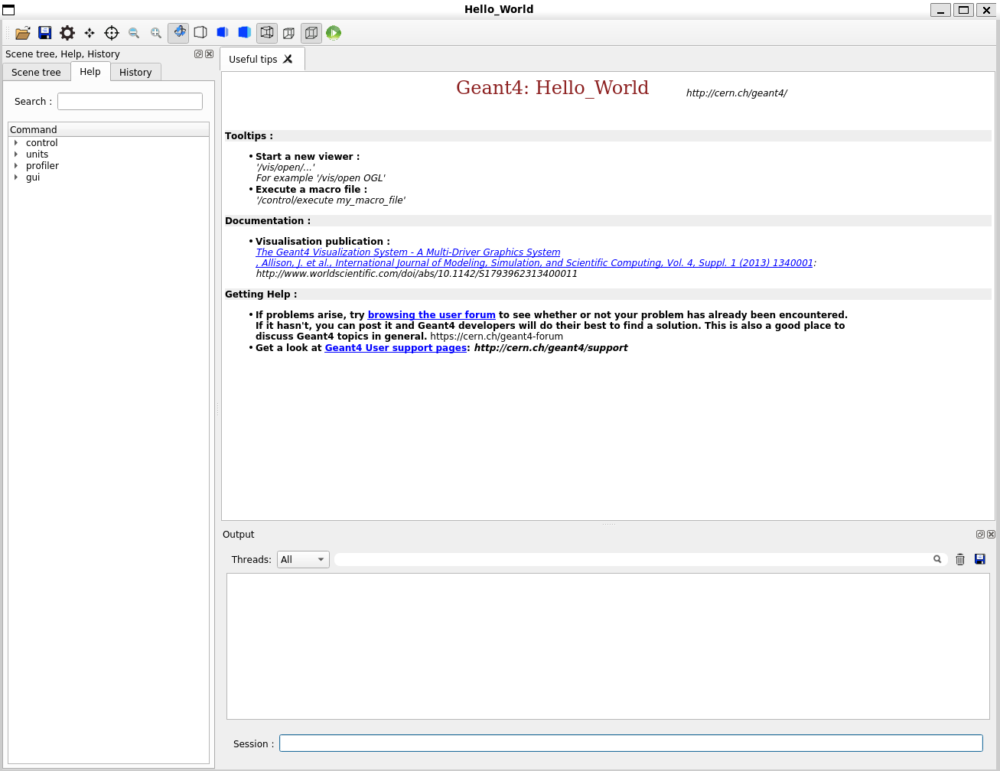

# How to install Geant4 on Linux

- [home](README.md)

- Author: John Francis
- Date: 8/21/2023
- Development environment: WSL (Windows subsystem for Linux, windows 11)

# Table of Contents
- [Intro](#intro)
- [Installing conda](#installing-conda)
- [Adding conda to path](#adding-conda-to-path)
- [Initializing bash for conda](#initializing-bash-for-conda)
- [Creating Geant4 environment](#creating-geant4-environment)
- [Dependencies](#dependencies)
- [Getting a test Geant4 app](#getting-a-test-geant4-app)
- [Using CMake to compile the test app](#using-cmake-to-compile-the-test-app)
- [Running test app](#running-test-app)
- [Debugging](#debugging)


# Intro:
[Geant4](https://geant4.web.cern.ch/) is a powerful physics modeling toolkit. In this tutorial I will be explaining how to install Geant4 on Linux.

This has been tested in WSL with windows 11 and ubuntu, but it should be similar using any Linux environment.

- [Linux commands](https://www.digitalocean.com/community/tutorials/linux-commands)
- [Geant4 installation guide](https://geant4-userdoc.web.cern.ch/UsersGuides/InstallationGuide/html/)

# Installing conda
We are going to use the conda package manager to install Geant4. Conda allows us to activate a Geant4 environment whenever we want to run Geant4.

A good option for installing conda is the lightweight miniconda installer. We can install this from the miniconda website by running:
```sh
wget https://repo.anaconda.com/miniconda/Miniconda3-latest-Linux-x86_64.sh
```
If you would like, you can verify the SHA-256 hash code with the code on the [Miniconda install page](https://docs.conda.io/en/latest/miniconda.html) by running:
```sh
shasum -a 256 Miniconda3-latest-Linux-x86_64.sh
```
Now, to install conda, set the correct permissions to the installer with:
```sh
chmod +x Miniconda3-latest-Linux-x86_64.sh
```
And run the installer with:
```sh
./Miniconda3-latest-Linux-x86_64.sh
```
# Adding conda to path
In order to use the conda command, you must add the miniconda bin directory to the path environment variable. To do this, run the following command (inserting the correct path to the miniconda3/bin directory)
```sh
echo 'export PATH="$PATH:/<path-to-miniconda3-dir>/miniconda3/bin"' >> ~/.bashrc
source ~/.bashrc
```
Now that conda has been added to the path variable, we can install Geant4.
# Initializing bash for conda
Before anything, we have to initialize bash for conda, that way we can run commands.
```sh
conda init bash
```
We need to close and re-open the shell for this to take effect.

To close, run:
```sh 
exit
```
# Creating Geant4 environment
- [Geant4 installation guide](https://geant4-userdoc.web.cern.ch/UsersGuides/InstallationGuide/html/)

First, we want to make sure we have the conda-forge channel. This channel has geant4 and several other dependencies we will need later. To get the conda forge channel, run:
```sh
conda config --add channels conda-forge
```

To create a geant4 environment, we can run:
```sh
conda create -n geant4env
```
The name "geant4env" is simply the name of our environment.

To activate and deactivate the environment, we can run:
```sh
conda activate geant4env
conda deactivate
```
For now, we want the environment activated.
```sh
conda activate geant4env
```
Now, let's install geant4 in the environment by running:
```sh
conda install -c conda-forge geant4
```

# Dependencies
If we want to use Geant4 or compile any Geant4 apps, we are going to need some dependencies.
Through the [Geant4 forum](https://geant4-forum.web.cern.ch/t/compile-geant4-from-conda-environment/4360/4), and my own testing, I have come up with this dependency list:

**Conda dependencies**
```sh
conda install make \
	cmake \
	compilers \
	sed \
	mesa-libgl-devel-cos6-x86_64 \
	mesa-dri-drivers-cos6-x86_64 \
	libselinux-cos6-x86_64 \
	libxdamage-cos6-x86_64 \
	libxxf86vm-cos6-x86_64 \
	python=3.9 \
	boost=1.72.0 \
	clhep=2.4.4.0 \
	expat \
	freetype \
	libglu \
	qt=5.12 \
	xerces-c \
	xorg-libx11 \
	xorg-libxfixes \
	xorg-libxmu \
	zlib \
	xorg-libxfixes \
	libxext-cos6-x86_64
```
**Apt dependencies**
```sh
sudo apt install libgl1-mesa-glx /
libxrender1
```

These dependencies are really important. For example, we have mesa drivers in our dependency list. This suggests that we will be able to use OpenGL for visualization. We also have python on the list, and unix platforms allow python coding with Geant4 which is amazing. Qt is on the list as well, which allows us to use the amazing qt gui.

If you want more information about these dependencies, you can look at my [notes](notes.md).

# Getting a test Geant4 app
In this tutorial we are going to test our installation by running, "Geant4-Hello-World." To get Geant4-Hello-World, first navigate to a directory that you want to store the source code in, like "desktop" or something.

Then, we need to make sure we have git installed. Try
```sh
git --version
```
and if you don't have git installed, install with 
```sh
apt install git
```
Now to get the correct version of G4-Hello-World, run: 
```sh
git clone https://github.com/john9francis/G4-Hello-World.git
```
And make sure to checkout the correct branch to make sure this works.
```sh
git checkout remotes/origin/v0.1.1
```
```sh
wget https://github.com/john9francis/G4-Hello-World/archive/refs/tags/G4-Hello-World-v0.1.1.zip
```
Then you can unzip this file by running, 
```sh
unzip G4-Hello-World-v0.1.1.zip
```

Inside the G4-Hello-World dir you should see the following files:
```sh
ls
# Output:
CMakeLists.txt     
Hello_World.cc  
compose.yaml        
mac_files
CMakePresets.json  
LICENSE         
g4_hello_world.png  
src
Dockerfile         
README.md       
include
```
**Make sure we are in Geant4 environment**

In these next steps, we are going to build this Geant4 test project, so we need to make sure we are in the Geant4 environment. Get into the Geant4 environment by running, 
```sh
conda activate geant4env
```
Then you should see the name of the environment in parenthesis pop up like so: 
```sh
(geant4env)
```

# Using CMake to compile the test app
Here's how we use cmake to build this project. First, we need to make two directories, build and install.
```sh
mkdir build
mkdir install
```
Then, we need to copy the path to install for later use.
```sh
cd install
pwd
# Output:
# home/path-to-G4-Hello-World/install
```
Make sure you copy this path.

Next, we need to navigate into the build directory
```sh
cd ..
cd build
```
Then, we run this following command to generate cmake build files:
```sh
cmake .. -DCMAKE_INSTALL_PREFIX=home/path-to-G4-Hello-World/install
```
After the `-DCMAKE_INSTALL_PREFIX=` option, paste the path to that install directory we copied earlier. 

Setting the `-DCMAKE_INSTALL_PREFIX=` is optional, but reccomended. If we don't specify an install_prefix and just run, `cmake ..`, it will install some files in the default directory which is somewhere you are going to have to go search for. I prefer to keep all the files in their own folder for organization. 

After you generate the build files, run:
```sh
make -j 16
```
This will build the Hello_World target, and the `-j 16` specifies that you want it to use "16 jobs." Basically it splits the work between 16 different threads to build the target much faster. This option is unnecessary for this small project, but for bigger projects it's very helpful.

Now we want to make the install target by running,
```sh
make install
```
Geant4 Hello World should be completely installed now.

# Running test app
The Geant4 Hello World executable is in the build directory, so we can run it from this directory. To run, type the command,
```sh
./Hello_World test.mac
```
And you should see "Hello World" display on the console.

To test the Qt gui, just run,
```sh
./Hello_World
```

And the gui will display like so:



Congratulations, you have installed Geant4 on Linux!

# Debugging
The first time I downloaded Geant4 on Linux, I was faced with all kinds of bugs and errors. To see my journey, just read through [my notes](notes.md). Hopefully this tutorial won't give you trouble, but here are some tips to help you debug if you get errors. 

**Make sure Geant4 environment is active**

Sometimes I didn't notice that my geant4env was not active when trying to run the test Geant4 applications. This causes issues because the app can't get linked with the Geant4 dlls, libraries, and source files. So just make sure your environment is active by running, 
```sh
conda activate geant4env
```

**Delete and re-make environment**

If you are still getting errors like "CMake can't find the OpenGL dir" or something like that, I would suggest deleting the entire Geant4 environment and starting over. You can do this by:
```sh
conda deactivate # deactivate the environment if it was active
conda env remove -n geant4env # delete the environment
conda create -c conda-forge --name geant4env geant4 # create environment and install geant4 in a single step
```
If it still doesn't work, you may have some missing dependencies.

**Install more dependencies**
If you're still getting errors building the Geant4 app, you might have some missing dependencies. 

If you are getting confusing errors, I would suggest asking ChatGPT what the error is saying, and 9 times out of 10 it's a missing dependency.
